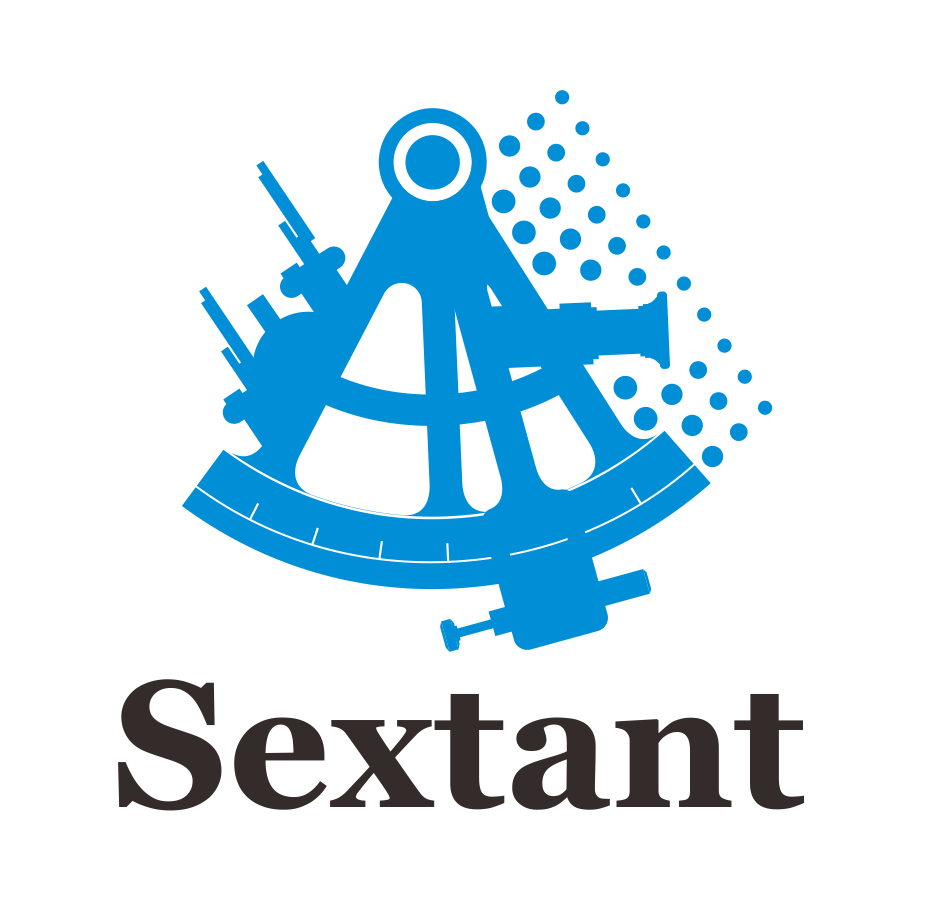

[](https://travis-ci.org/k8sp/sextant.svg?branch=master)

# sextant
sextant 提供了可以通过PXE全自动化安装初始化一个CoreOS+kubernetes集群。


## 环境准备
bootstrapper需要运行在一台服务器上(以下称bootstrapper server)，满足以下的几个要求：

1. 待初始化的kubernetes机器需要和bootstrapper server保持网络连通
1. bootstrapper server是一台安装有docker daemon(***1.11以上版本***)的Linux服务器
1. 拥有bootstrapper server的root权限
1. 配置bootstrapper server的/etc/hosts文件，增加hostname的解析：```127.0.0.1  bootstrapper```

## 初始化配置和准备bootstrapper需要的镜像文件
***在能访问互联网的一台机器上完成下面的准备环境，配置，创建Docker镜像的步骤***
* 注：如果bootstrapper机器没有互联网访问，可以事先准备好/bsroot目录然后上传到boostrapper server

获取sextant代码后，根据要初始化的整体集群规划，
编辑cloud-config-server/template/cluster-desc.sample.yaml文件完成配置
然后下载bootstrapper用到的文件到/bsroot目录下
```
go get -u -d github.com/k8sp/sextant/...
cd $GOPATH/src/github.com/k8sp/sextant
vim cloud-config-server/template/cluster-desc.sample.yaml
./bsroot.sh cloud-config-server/template/cluster-desc.sample.yaml
```

## 上传到集群内部的bootstrapper机器
如果上述步骤是在bootstrapper服务器上完成的，则可以跳过此步骤。

1. 手动打包./bsroot目录：```tar czf bsroot.tar.gz ./bsroot```
1. 将bsroot.tar.gz上传到你的bootstrapper机器上（使用scp或ftp等工具）
1. 在bootstrapper机器上解压bsroot.tar.gz到/目录

## 启动bootstrapper
```
ssh root@bootstrapper
cd /bsroot
./start_bootstrapper_container.sh /bsroot
```

## 通过bootstrapper来初始化您的kubernetes集群
***只需要设置kubernetes节点通过PXE网络引导，并开机(和bootstrapper网络联通)，就可以自动完成kubernetes和ceph安装***

## 使用集群

### 配置kubectl客户端
```
scp root@bootstrapper:/bsroot/setup-kubectl.bash ./
./setup-kubectl.bash
```

### 测试kubectl客户端可用
执行下面的命令，观察返回结果是否正常，判断是否已经成客户端的正确配置：
```
bootstrapper ~ # ./kubectl get nodes
NAME                STATUS                     AGE
08-00-27-4a-2d-a1   Ready,SchedulingDisabled   1m
```

### 使用ceph集群
在集群安装完成之后，可以使用下面的命令获得admin keyring作为后续使用
```
etcdctl --endpoints http://08-00-27-ef-d2-12:2379 get /ceph-config/ceph/adminKeyring
```
比如，需要使用cephFS mount目录：
```
mount -t ceph 192.168.8.112:/ /ceph -o name=admin,secret=[your secret]
```
